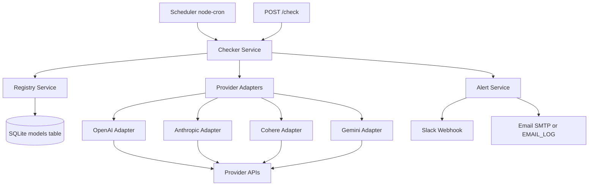

# Sentinel Architecture

## Overview

Sentinel is a standalone Node.js + TypeScript microservice that continuously validates LLM model health, detects deprecations, and raises alerts before customer traffic fails.

## Component Diagram

## Runtime Flow

1. Scheduler (or manual POST /check) calls the Checker Service.
2. Checker loads all registry models from SQLite and groups them by provider.
3. Providers are checked in parallel.
4. For each provider:
   - Fetch live model list.
   - Mark missing registry models as deprecated.
   - Verify listed models with retry and backoff for transient failures.
5. Registry statuses are updated with metadata and timestamps.
6. Alert Service sends critical/warning notifications to Slack and optional email.

## Data Model

Table: models

- id: integer primary key
- provider: text
- modelId: text
- status: active | deprecated | error | unknown
- lastVerified: datetime
- metadata: JSON string (transient counters, flags)
- deprecationDate: datetime (set when status becomes deprecated)
- sunsetDate: datetime (optional when provider returns it)
- unique(provider, modelId)

## Reliability and Fail-Safes

- Transient retries: up to 2 retries with exponential backoff.
- Persistent transient failures: warning alert after 2 consecutive runs.
- Deprecated/auth failures: immediate critical alert.
- CI guard test: fails if deprecated models are not accompanied by deprecated alerts in the run.

## Integration Points with Mozart (Optional Extension)

Sentinel output is a normalized alert payload and updated model status store. A Mozart sync module can consume deprecated model statuses and call mocked Mozart config endpoints for create/delete operations.
