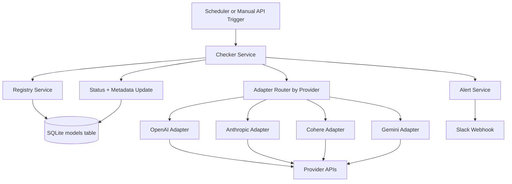

# Sentinel Service

Sentinel is a standalone Node.js/TypeScript microservice that monitors LLM model health and detects deprecations before they cause silent failures.

It maintains a model registry, checks providers (OpenAI, Anthropic, Cohere, Gemini), updates model status, and sends alerts for critical conditions.

## What This Service Does

- Stores model registry records in SQLite
- Runs provider health checks using adapter pattern
- Detects deprecated models by comparing registry models vs provider model lists
- Verifies model reachability/API health per model
- Retries transient failures with exponential backoff
- Escalates warnings when transient failures continue across runs
- Sends alerts through Slack webhook
- Exposes Swagger UI and REST endpoints for manual checks

## Architecture



## High-Level Flow

1. Load all registry models.
2. Group models by provider.
3. For each provider:
   - Fetch live model list from adapter.
   - Mark missing registry models as deprecated and alert critical.
   - Verify existing models with retry for transient failures.
4. Persist status and metadata (including transient failure counters).
5. Send critical or warning alerts based on status and escalation rules.

## Project Structure

- src/index.ts: app bootstrap, Swagger mounting, route wiring, scheduler start
- src/modules/checker/checker.service.ts: core health-check orchestration
- src/modules/adapters/*.ts: provider adapters
- src/modules/registry/registry.service.ts: DB model read/write
- src/modules/alerting/alert.service.ts: Slack alert sender
- src/modules/scheduler/scheduler.service.ts: cron scheduling
- src/routes/model.routes.ts: manual APIs used by Swagger
- src/database/seed.ts: model seed data

## Data Model

Table: models

- id: integer primary key
- provider: text
- modelId: text
- status: active | deprecated | error | unknown
- lastVerified: datetime
- metadata: json string (stores transient counters and flags)
- deprecationDate: datetime
- unique(provider, modelId)

## Prerequisites

- Node.js 18+
- pnpm

## Installation

```bash
pnpm install
```

## Environment Variables

Create a .env file in project root:

```env
USE_MOCK=true
MOZART_API_URL=https://api-dev.mozart.la
MOZART_API_TOKEN=
OPENAI_API_KEY=
ANTHROPIC_API_KEY=
COHERE_API_KEY=
GEMINI_API_KEY=
SLACK_WEBHOOK_URL=
```

Notes:
- USE_MOCK=true is useful for local/demo testing.
- Set SLACK_WEBHOOK_URL to send real Slack alerts. If missing, alerts are logged.
- MOZART_API_TOKEN is required for authenticated Mozart config sync calls.

## Run the Service

Development:

```bash
pnpm dev
```

Build:

```bash
pnpm build
```

Run built app:

```bash
pnpm start
```

Swagger UI:

- http://localhost:3000/api-docs

Health:

- http://localhost:3000/health

## Manual Testing via Swagger/Curl

Base URL:

```bash
BASE_URL=http://localhost:3000
```

### 1) List registry models

```bash
curl -X GET "$BASE_URL/models"
```

### 2) Trigger full health check manually

```bash
curl -X POST "$BASE_URL/check"
```

### 3) Fetch provider model list from adapter

OpenAI:

```bash
curl -X GET "$BASE_URL/check/openai/models"
```

Anthropic:

```bash
curl -X GET "$BASE_URL/check/anthropic/models"
```

Cohere:

```bash
curl -X GET "$BASE_URL/check/cohere/models"
```

Gemini:

```bash
curl -X GET "$BASE_URL/check/gemini/models"
```

### 4) Verify one model manually

OpenAI:

```bash
curl -X POST "$BASE_URL/check/openai/verify" \
  -H "Content-Type: application/json" \
  -d '{"modelId":"gpt-4o"}'
```

Anthropic:

```bash
curl -X POST "$BASE_URL/check/anthropic/verify" \
  -H "Content-Type: application/json" \
  -d '{"modelId":"claude-3-5-sonnet"}'
```

Cohere:

```bash
curl -X POST "$BASE_URL/check/cohere/verify" \
  -H "Content-Type: application/json" \
  -d '{"modelId":"command-r"}'
```

Gemini:

```bash
curl -X POST "$BASE_URL/check/gemini/verify" \
  -H "Content-Type: application/json" \
  -d '{"modelId":"gemini-1.5-flash"}'
```

### 5) Unsupported provider example

```bash
curl -X GET "$BASE_URL/check/invalid/models"
```

Expected: HTTP 400 with unsupported provider message.

## Scheduler

Scheduler runs every N hours via node-cron, controlled by HEALTH_CHECK_INTERVAL_HOURS (default: 6).

## Alert Rules

- Critical: model deprecated
- Critical: API/auth error
- Warning: transient/unreachable status (unknown)
- Escalation: warning alert sent after repeated transient failures across runs

## TLS Certificate Note

For local API calls in this project, TLS certificates are not required because local endpoints use HTTP on localhost.

Curl examples intentionally exclude --insecure/-k.

For provider API calls in production, keep TLS verification enabled.

Tests no longer disable TLS verification globally.

## Assignment Mapping Summary

- Model registry and statuses: implemented
- Provider adapters: implemented (OpenAI, Anthropic, Cohere)
- Deprecation detection: implemented via registry-vs-provider comparison
- Retry logic with backoff: implemented
- Warning escalation across runs: implemented
- Slack + optional email alerting: implemented
- Manual API + Swagger: implemented
- Automated tests (unit + integration): implemented
- CI guard for deprecated-without-alert: implemented
- Demo failure script: implemented
- Mozart Sync (optional extension): implemented with unit tests and API spec

## Mozart Endpoint Access Check

Connectivity test results from this environment:

- GET https://api-dev.mozart.la -> 200
- POST https://api-dev.mozart.la/api/v1/config/getModels (no auth) -> 401

This confirms the endpoint is reachable and requires authentication.

## Assignment Requirement Mapping (Line-by-Line)

### 1) Model Registry

- Requirement: SQLite or PostgreSQL schema with id, provider, modelId, status, lastVerified, metadata.
  - Status: Implemented with SQLite.
  - Notes: Includes id, provider, modelId, status, lastVerified, metadata, plus deprecationDate.
- Requirement: Seed at least 6 models across 3 providers.
  - Status: Implemented.
  - Notes: Seed contains OpenAI, Anthropic, Cohere, and Gemini entries.
- Requirement: Status states active, deprecated, error, unknown.
  - Status: Implemented.
- Requirement: Version/deprecation tracking.
  - Status: Implemented via deprecationDate.

### 2) Provider Adapters

- Requirement: OpenAI, Anthropic, Cohere adapters.
  - Status: Implemented.
- Requirement: Fetch current model list per provider.
  - Status: Implemented with fallback behavior.
  - Notes: OpenAI and Cohere fetch from API in real mode; Anthropic verifies known models against API and falls back conservatively.
- Requirement: Lightweight ping/key validity check.
  - Status: Implemented.
  - Notes: OpenAI, Anthropic, and Cohere perform request-based checks; missing/invalid keys map to auth failures.
- Requirement: Error code mapping (401/404/429/500) and differentiation.
  - Status: Implemented in centralized mapper.
  - Notes: Auth/deprecated/rate-limit/internal-error are differentiated.

### 3) Scheduled Health Checks

- Requirement: Run every 6 hours (configurable via env).
  - Status: Implemented.
  - Notes: Configurable via HEALTH_CHECK_INTERVAL_HOURS, defaulting to 6.
- Requirement: Concurrency (providers in parallel).
  - Status: Implemented.
  - Notes: Provider checks run in parallel via Promise.all.
- Requirement: Retry up to 2 times with backoff for transient failures.
  - Status: Implemented.
  - Notes: Exponential backoff retries added in checker flow.
- Requirement: Deprecation detection by registry-vs-provider-list compare.
  - Status: Implemented.

### 4) Alerting

- Requirement: Slack webhook (required) and optional email log.
  - Status: Implemented.
  - Notes: Slack webhook plus optional SMTP/email log fallback are supported.
- Requirement: Critical alerts for deprecated/auth invalid immediately.
  - Status: Implemented.
- Requirement: Warning for transient; alert if still failing after 2 runs.
  - Status: Implemented.
  - Notes: Persisted counters in metadata with escalation logic.
- Requirement: Payload includes model id, provider, status, timestamp, message.
  - Status: Implemented.
  - Notes: Alert payload carries structured fields and Slack formatting.

### 5) REST API (Optional but Recommended)

- Requirement: GET /health, GET /models, POST /check.
  - Status: Implemented.
- Requirement: API documentation via Swagger or README curl examples.
  - Status: Implemented.
  - Notes: Swagger UI and curl examples provided in this README.

### 6) Testing and Fail-Safes

- Requirement: Unit tests for adapters/status mapping/retry.
  - Status: Implemented.
- Requirement: Integration test for 404 -> alert trigger.
  - Status: Implemented.
- Requirement: CI fail-safe for deprecated-without-alert (or documented reason).
  - Status: Implemented.
  - Notes: CI runs a guard test to assert deprecated models produce deprecated alerts in the same run.

## Future Improvements

- Add persistent alert history table for stronger auditability across runs
- Add provider-specific circuit-breakers to reduce noise during outages
- Add PostgreSQL option and migration scripts for production deployment
